---
output:
  xaringan::moon_reader:
    includes:
    self_contained: false
    lib_dir: libs
    nature:
      highlightStyle: github
      highlightLines: true
      countIncrementalSlides: false
editor_options: 
  chunk_output_type: console
---
class: center, middle, inverse
background-image: url("Figures/Background_ch2.png")
background-size: cover
background-color: #b33d3d

```{css echo=FALSE}
.pull-left {
  float: left;
  width: 44%;
}
.pull-right {
  float: right;
  width: 44%;
}
.pull-right ~ p {
  clear: both;
}


.pull-left-wide {
  float: left;
  width: 66%;
}
.pull-right-wide {
  float: right;
  width: 66%;
}
.pull-right-wide ~ p {
  clear: both;
}

.pull-left-narrow {
  float: left;
  width: 33%;
}
.pull-right-narrow {
  float: right;
  width: 33%;
}
.pull-right-narrow ~ p {
  clear: both;
}

.small123 {
  font-size: 0.80em;
}

.large123 {
  font-size: 2em;
}
```


# Holy Cows and Spilt Milk:
## A Firm Level Analysis of the Impact of Religiousity on Productivity

### Christian Vedel, University of Southern Denmark 
#### (Christian-vs@sam.sdu.dk; @ChristianVedel)

### Coauthored with Jeanet Bentzen, Nina Boberg-Fazlic, Paul Sharp, Christian Volmar Skovsgaard

???
.large123[**---> 19 <----**] 

---
# Introduction

.pull-left[
- Danish industrialisation is also agricultural (Sharp & Lampe, 2019)
- Portrayed as a consequence of homogeneity and lack of conflict 
- Contrast with Ireland 
- But did conflict and religiosity play any role for Danish development?
- **Can non-violent religious conflicts also have adverse effects?**


- **Finding:** Religious conflict drove lower productivity
]

.pull-right[
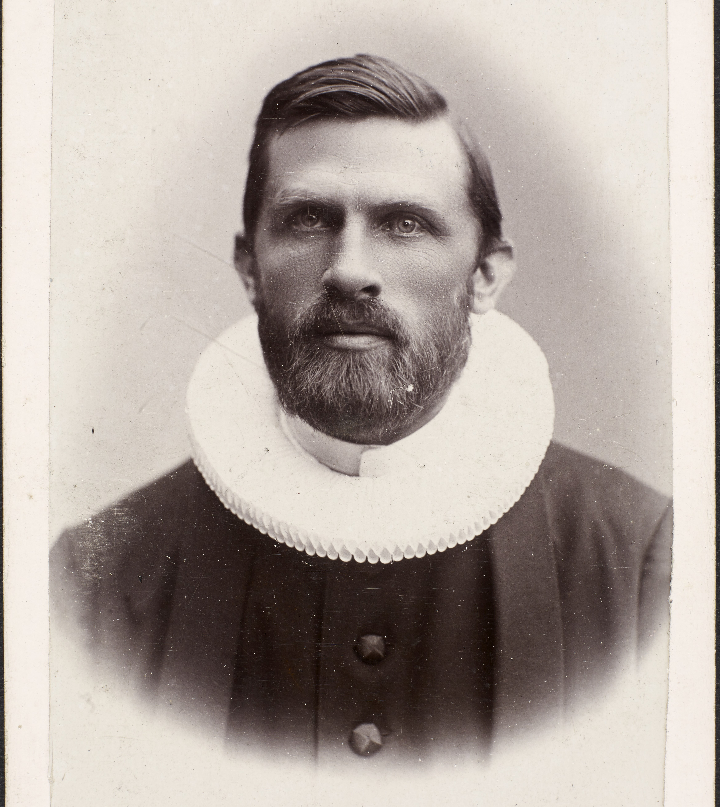
Carl Moe, kb.dk
]

???
.large123[**---> 21 <----**] 

---
# Imagine that chimney on a Sunday
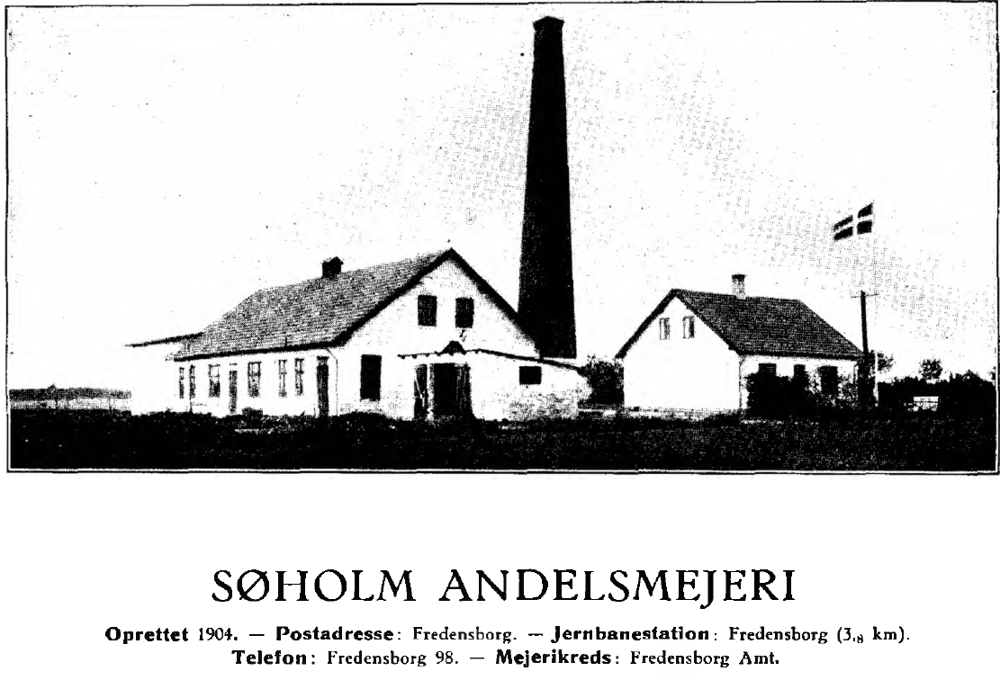

???
.large123[**---> 22 <----**] 

---
# Historical background 
.pull-left[
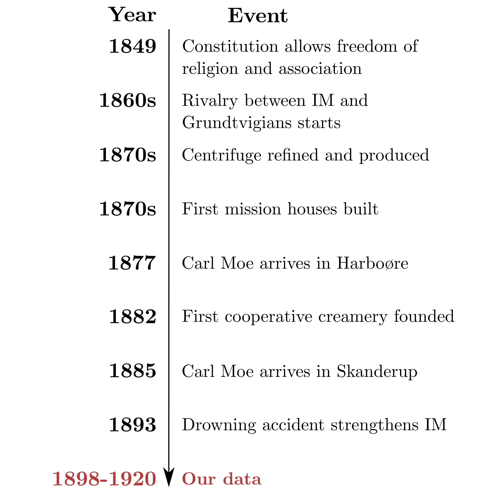
] 

.pull-right[

]


---
# Data and identification
.pull-left[
**Data:**
- Missionhouses: When and where 

- Creamery statistics (Sharp et al, 2023) + location 
  + 11685 observations on 964 creameries
  + Milk, Butter, influence of IM and various controls


]

.pull-right[
**Empirical strategy:** 
- Milk butter ratio: How much milk does it take to produce a unit of butter?

$$MB_{it}= IM_{it}\beta_1+\mathbf{z}_{it}\gamma+FE+\varepsilon_{it}$$
$$ln(Butter_{it})= ln(Milk_{it})\beta_1+IM_{it}\beta_2+...$$
]

???
.large123[**---> 23 <----**] 
What about a bad harvest?

---
# IM influence in 1890
```{r echo=FALSE, out.width="100%", fig.align='center'}
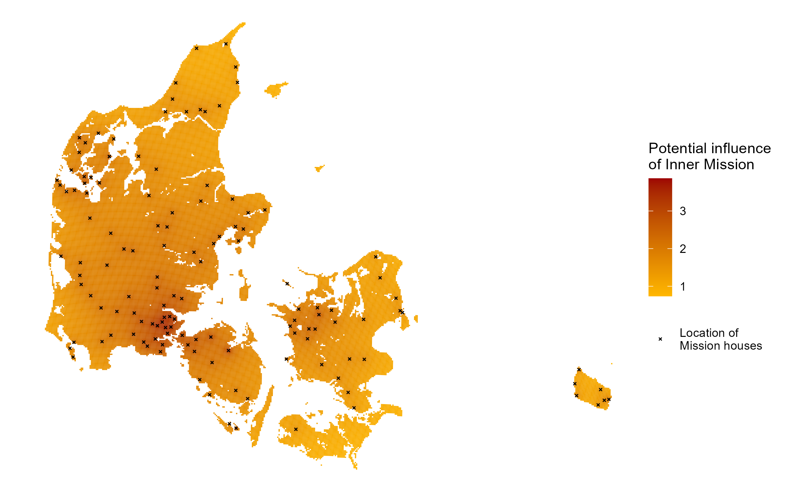
```

???
.large123[**---> 24 <----**]

---
# IM influence in 1920
```{r echo=FALSE, out.width="100%", fig.align='center'}
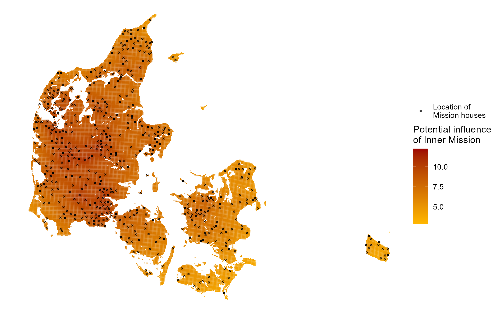
```

???
.large123[**---> 24 <----**]

---
# Results OLS
.pull-right-narrow[
**Interpretation**
- Robust negative association between IM and productivity 
- Large and meaningful effect size

- **Effect**: ~ -25000 (2010 USD Equiv)
]

.pull-left-wide[
```{r echo=FALSE, out.width="90%", fig.align='center'}
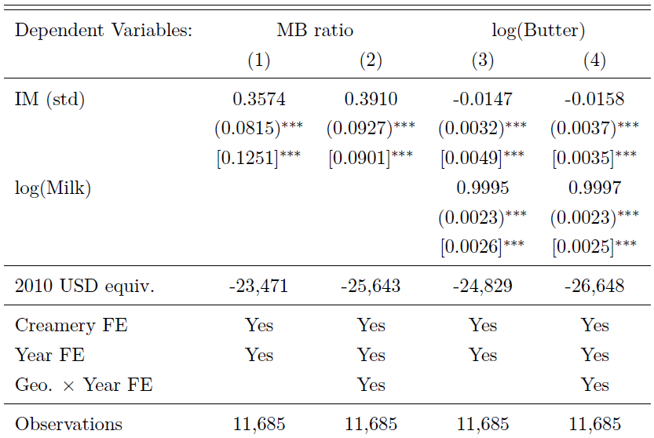
```
]

???
.large123[**---> 24 <----**]

---
# Results IV
.pull-left-wide[
```{r echo=FALSE, out.width="90%", fig.align='left'}
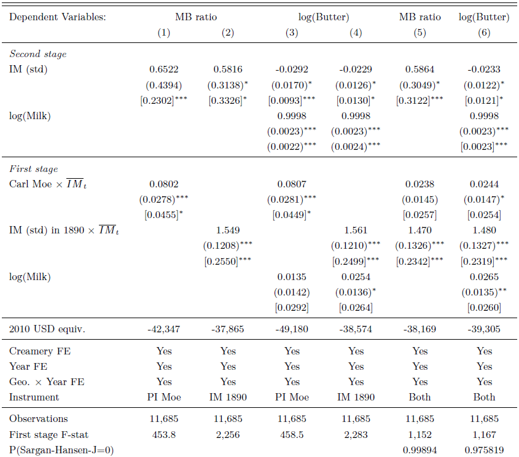
```
]

.pull-right-narrow[
**Instruments:**
- Early IM would cause later IM (it is in the name) 
1. Carl Moe was semi-randomly appointed to Harboører and Skanderup 
2. IM in 1890, before our data 


**Interpretation**
- Robust negative association between IM and productivity 

- **Effect**: ~ -40000 (2010 USD Equiv)
]

???
.large123[**---> 24 <----**]

---
# Mechanisms
.pull-left-narrow[
**Results**
- We *cannot* find that Sabbatical production had a negative impact on productivity 
- We *can* demonstrate indicators of conflict were associated with IM
]

.pull-right-wide[
```{r echo=FALSE, out.width="95%", fig.align='right'}

```
]

???
.large123[**---> 25 <----**]

---
# Conclusion 
.pull-left[
- Non violent religious conflict can have large negative effects on the economy (~25,000 2010 USD) 
- Non-conflict take-off should be reinterpreted 
]

.pull-right[

Carl Moe, kb.dk
]

.footnote[
**Email:** christian-vs@sam.sdu.dk  
**Twitter:** @ChristianVedel  
Feel free to contact me :-)
]


???
.large123[**---> 26 <----**]

---
name: appendix2
count: false
class: center, middle, inverse
background-color: #b33d3d
# Chapter 2
# Appendix

.footnote[
[Back](#apendicies)
]

---
# Mechanisms
.pull-left[

1. We can test whether it is carried by Sabbatical production itself 
2. We can test whether there are 'smoking guns' of conflict 
]

.pull-right[
**Results**
- We *cannot* find that Sabbatical production had a negative impact on productivity 
- We *can* demonstrate indicators of conflict were associated with IM
]

---
# Was Sabbatical production the mechanism behind negative effect of IM? 
```{r echo=FALSE, out.width="75%", fig.align='center'}
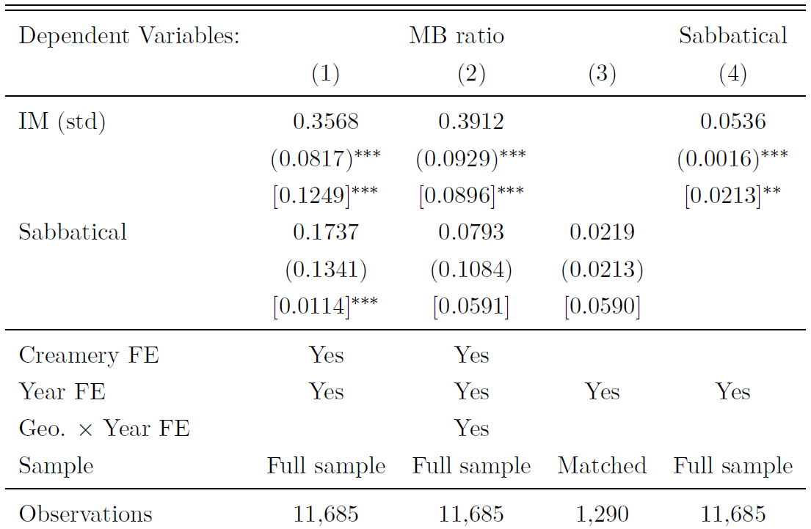
```

---
# Could conflict feasibly be the mechanism? 
```{r echo=FALSE, out.width="75%", fig.align='center'}
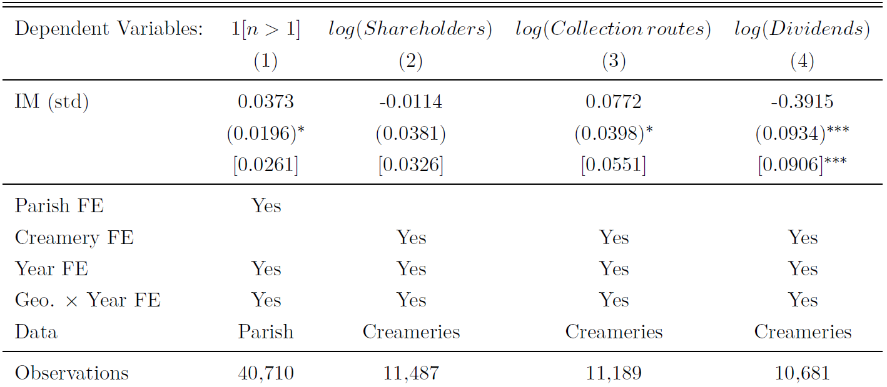
```

---
# Does sabbatical production matter? (1/4)
.pull-left-wide[
**MB ratio versus Sabbatical**
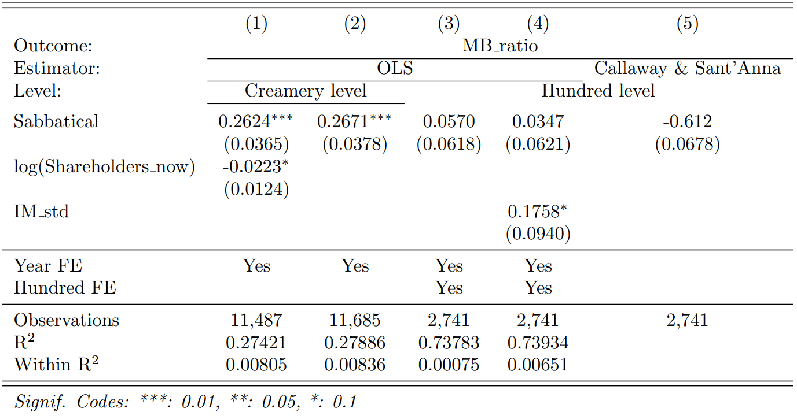
]

.pull-right-narrow[
**Interpretation**
- Places with Sabbatical creameries are less productive (1-2)
- No effect at the hundred level (3-5) 
- No effect at the creamery level (table 4, col. 3)
- 123 Hundreds vary in Sabbatical status
]

---
# Does sabbatical production matter? (2/4)
.pull-right-wide[
**Dividends versus Sabbatical**
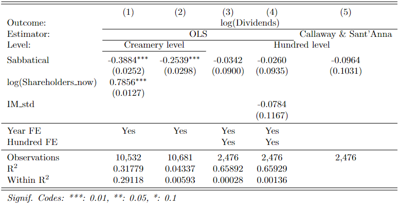
]

.pull-left-narrow[
**Interpretation**
- Same result for dividends
- 123 Hundreds vary in Sabbatical status
]

---
# Does sabbatical production matter? (3/4)
### Event plot MB ratio (Callaway & Sant'Anna Estimator)
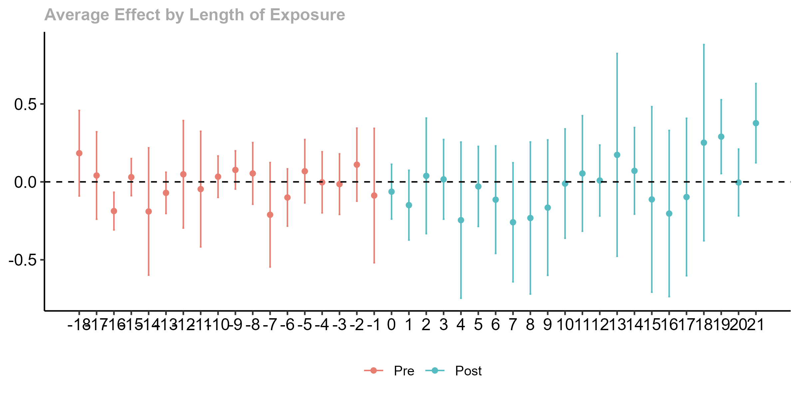
.center[.small123[***Hundred level data***]]

---
# Does sabbatical production matter? (4/4)
### Event plot MB ratio (Callaway & Sant'Anna Estimator)
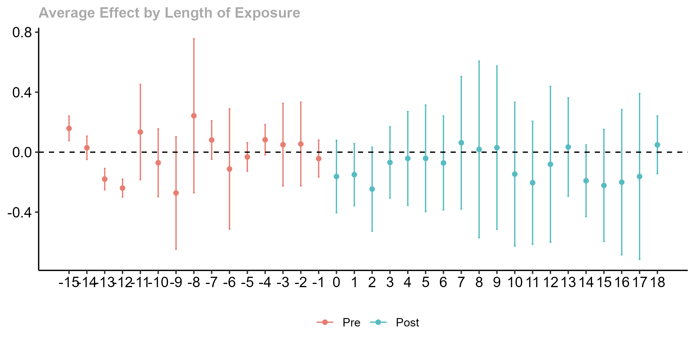
.center[.small123[***Hundred level data***]]

---
# Alternative measures of IM 
.pull-left[
**Being in parish with Mission house**
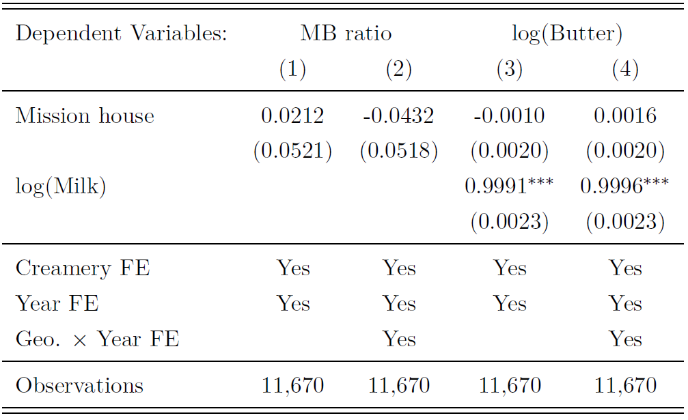
]

.pull-right[
**Number of Mission houses within 25km**
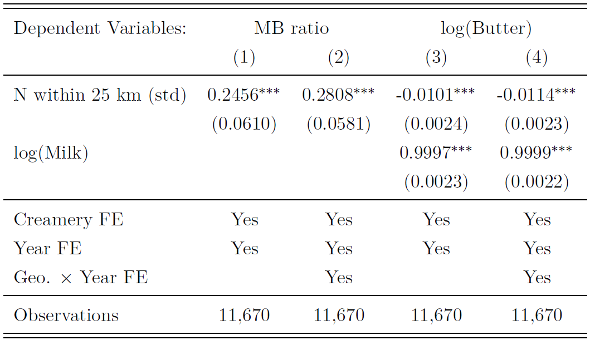
]

**Interpretation** 
- We can define the measure of IM influence in various ways. 
- We get the same result or a more noisy result 
- IV benefits from a continuous measure


---
# Testing instrument validity
.pull-left-wide[
```{r echo=FALSE, out.width="75%", fig.align='center'}
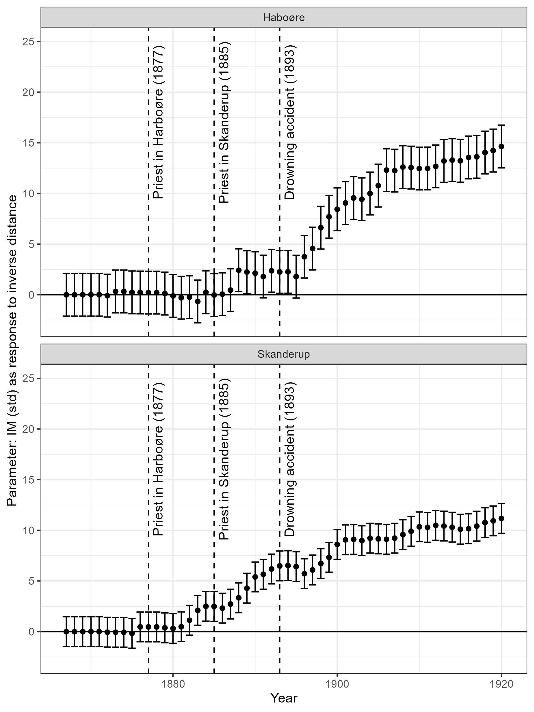
```
]

.pull-right-narrow[
- Semi-random appointment of Carl Moe 
- Legal turmoil after constituion §80/§66: *"The Constitution of the People's Church is regulated by law"* 
- Defaulted to the King 
- Carl Moe is consistently associated with more IM influence
- Bartik Instrument assumptions (Goldsmith-Pinkham et al., 2020): 
  + Original exposure is random *or* 
  + Changes are random
]

